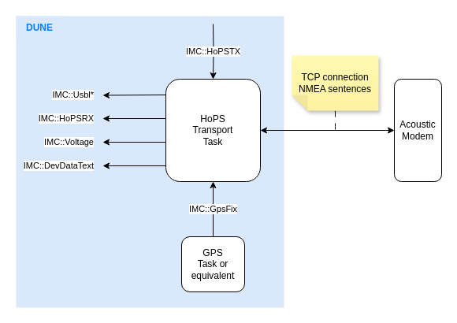
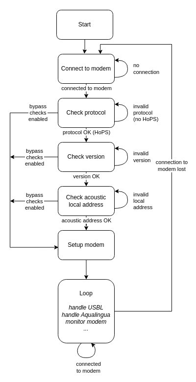

# HoPS DUNE Integration

## General Description

HoPS is the EvoLogics acoustic Hybrid communication and Positioning System.
It is used for the transmission of **positioning information** and **data messages** over underwater acoustic channels.
Additionally, it provides the possibility to configure some modem settings, such as the source level, and to collect modem status information, such as the battery voltage.
For the transmission of data messages, HoPS uses a protocol called **Aqualingua**.
For more information, consult the HoPS documentation.

This Task provides a DUNE transport for HoPS.
Specifically, the Task allows to:

- configure, start, and stop the acoustic interrogation cycle (baseline nodes, target nodes, timing information, GPS reference, ...).
- receive and dispatch acoustic USBL positions/fixes over IMC.
- send/receive acoustic Aqualingua data messages.
- set the [modem source level](https://www.notion.so/evologics/HoPS-NMEA-Protocol-0dd85ab9c23842cb96d5fb33aa1ecb28?source=copy_link#1b4139ca7dd1801ca354d9fc9c57a737).
- set the modem [transmit (TX) state](https://www.notion.so/evologics/HoPS-NMEA-Protocol-0dd85ab9c23842cb96d5fb33aa1ecb28?source=copy_link#1b4139ca7dd180d7ba0dc0e1b080ed0f).
- verify and log the [firmware version](https://www.notion.so/evologics/HoPS-NMEA-Protocol-0dd85ab9c23842cb96d5fb33aa1ecb28?source=copy_link#1b4139ca7dd18054ba2ffbf0a1b97ded) on the modem.
- periodically request and log the [modem battery voltage](https://www.notion.so/evologics/HoPS-NMEA-Protocol-0dd85ab9c23842cb96d5fb33aa1ecb28?source=copy_link#1b4139ca7dd180e39b02ead478ad9958).

The Task behavior can be controlled through IMC (see [IMC Interface](#imc-interface)) and through the Task parameters (see [Configuration](#configuration)).

> :information_source: **HoPS Feature Support**<br>
> This Task does not provide a full implementation of the HoPS protocol.
> The current implementation is tailored towards the use of HoPS on vehicles and buoys.
> It is made to be extensible, so that it can hopefully be adapted to other use cases as needed.

> :information_source: **USBL Only**<br>
> This Task currently only supports USBL positioning.
> Additional positioning methods already supported by HoPS (i.e. syncLBL) are planned to be added in the future.


## Interfaces & Data Flow



### HoPS NMEA Interface

This Task uses the HoPS NMEA interface over a TCP connection to the modem.
The NMEA interface contains proprietary EvoLogics NMEA sentences described in more detail [here](https://www.notion.so/evologics/HoPS-NMEA-Protocol-0dd85ab9c23842cb96d5fb33aa1ecb28) (for HoPS control and positioning) and [here](https://www.notion.so/evologics/HoPS-Aqualingua-NMEA-interface-00bce9ab6a214b6491c6d890dc840289) (for HoPS AquaLingua).

### IMC Interface

The following IMC messages are consumed/dispatched by the Task:

| Message | Direction | Description |
|---------|-----------|-------------|
| `IMC::TriggerAction` | Consumed | For setting the HoPS configuration, starting/stopping HoPS, or forcing a Task restart. For more details, see [TriggerAction Interface](#triggeraction-interface). |
| `IMC::UsblPosition`  `IMC::UsblPositionExtended`  `IMC::UsblFix`  `IMC::UsblFixExtended`  `IMC::UsblAngles`  `IMC::UsblAnglesExtended`  | Dispatched | USBL position information received from the modem. These messages can be partially or completely disabled, see [Configuration](#configuration). |
| `IMC::HoPSRX` | Dispatched | Aqualingua data messages received through acoustics. |
| `IMC::HoPSTX` | Consumed | Aqualingua data messages to be sent over acoustics. |
| `IMC::Voltage` | Dispatched | Modem battery voltage information received from the modem. |
| `IMC::GpsFix` | Consumed | GPS fix that can optionally be used to set the HoPS GPS reference position (see [Configuration](#configuration)). |
| `IMC::DevDataText` | Dispatched | All lines received from the modem over the TCP connection (for debugging purposes). |

#### TriggerAction Interface

To control Task behavior, `IMC::TriggerAction` messages must be sent with event `TAE_REQUEST` (0).
The following actions are supported:

| Action ID | Description |
|-----------|-------------|
| 0 | Set the HoPS configuration (baseline nodes, target nodes, timing information, GPS reference, ...). When this request is received, the task updates the HoPS configuration based on the values in the Task parameters (see [Configuration](#configuration)). |
| 1 | Start the HoPS acoustic interrogation cycle. This also sets the HoPS configuration before starting (similar to action 0 above). |
| 2 | Stop the HoPS acoustic interrogation cycle. |
| 255 | Restart the Task. **This action should ideally not be used; it is a failsafe in case the Task is "blocked" or goes into a weird state.** |


### Configuration

The Task has the following parameters:

| <div style="width:250px">Parameter</div> | Type | Description |
|-----------|------|-------------|
| HoPS Connection | string | The connection string to connect to HoPS. |
| Monitor Period | float | The period in seconds for monitoring HoPS (battery voltage, HoPS status, etc...). |
| Bypass Startup Checks | bool | If true, the Task will bypass any checks it performs at the start (firmware version check, local address check, etc...) and go directly to nominal operation once connection has been established.<br>*This is useful when e.g. working with experimental HoPS versions that get updated regularly.* |
| Startup Check Timeout | float | If a check performed at startup is not fulfilled after this time in seconds, an error is logged. |
| Expected HoPS Version | string | The expected firmware version of HoPS on the modem. |
| Expected Evins Version | string | The expected firmware version of Evins on the modem. |
| Expected Network Layer Version | string | The expected firmware version of the modem network layer. |
| Interrogation Profile<br>Basenodes<br>Targets<br>Answer Delay<br>Basenode Slot Offset<br>Target Slot Offset<br>GPS Reference Latitude<br>GPS Reference Longitude<br>Pressure Factor<br>Interrogation Master ID<br>Inactivity Counter<br>Epoch Time | string | Parameters describing the HoPS interrogation configuration; more information about these can be found in the [HoPS documentation](https://www.notion.so/evologics/HoPS-NMEA-Protocol-0dd85ab9c23842cb96d5fb33aa1ecb28?source=copy_link#9eb7f8ba048d4f128eb4689a6c5d9653). |
| Use GPS Fix As Reference | bool | If true, the GPS reference position is taken from the latest `IMC::GpsFix` message received by the Task.<br>If false, the GPS reference position is taken from the parameters `GPS Reference Latitude` and `GPS Reference Longitude`. |
| Source Level | int | The source level to set on the modem.<br>Goes from `0` (highest source level) to `3` (lowest source level). |
| Transmit | bool | Control of the modem TX state (the [Transmission control mode](https://www.notion.so/evologics/HoPS-NMEA-Protocol-0dd85ab9c23842cb96d5fb33aa1ecb28?source=copy_link#1b4139ca7dd180d7ba0dc0e1b080ed0f)).<br>When set to false, the modem is silent, irrespective of the HoPS status.<br>This is used in the USBL-Sonobot to prevent the modem from being active when the USBL arm is in air (to avoid damage to the transducer). |
| Send IMC Positioning Messages | bool | If true, the Task will dispatch `IMC::UsblPosition`, `IMC::UsblFix` and `IMC::UsblAngles` upon reception of USBL positions from HoPS. |
| Send Extended IMC Positioning Messages | bool | If true, the Task will dispatch `IMC::UsblPositionExtended`, `IMC::UsblFixExtended` and `IMC::UsblAnglesExtended` upon reception of USBL positions from HoPS. |
| Contact Timeout | float | The time in seconds after which an acoustic contact is considered lost. |

## Logic Description

### State Machine

The task follows a state machine that looks like below:



### Task Status Message

In nominal state, and when the Task is not in error (see [Failure Cases](#failure-cases) below), the Task's status message informs about the current state of HoPS, the modem and the acoustic contacts:
```
<STATUS>, al:<LOCAL_ADDRESS>, l:<SOURCE_LEVEL>, tx:<TX_STATE>, c:<LIST_OF_CONTACTS>
```
Where:

- `<STATUS>` is the current [internal state](https://www.notion.so/evologics/HoPS-NMEA-Protocol-0dd85ab9c23842cb96d5fb33aa1ecb28?source=copy_link#1b3139ca7dd18008a685fa1dd0c3ed3f) of HoPS (running, idle, ...).
- `<LOCAL_ADDRESS>` is the local address of the modem.
- `<SOURCE_LEVEL>` is the current source level of the modem.
- `<TX_STATE>` is the current TX state of the modem (`on` or `off`).
- `<LIST_OF_CONTACTS>`: a comma-separated list of acoustic nodes from which activity was heard in the last `Contact Timeout` seconds (see [Configuration](#configuration)). If there are no contacts, `no contacts` is displayed instead.

Example:
```
idle, al:12, l:0, tx:on, c:2,3,4
```

### Failure Cases

#### No Connection / Connection Lost
The Task cannot establish a connection to the modem.
In this case, an error is logged and the Task waits in the "Connect to modem" state until connection can be established.

#### No HoPS
A connection could be established, but there is not HoPS interface at the specified address.
In this case, an error is logged and the Task waits in the "Check protocol" state.

#### Incorrect Version
No version information was returned by HoPS, or the version returned by HoPS does not match the expected version.
In this case, an error is logged and the Task waits in the "Check version" state.

#### Invalid Local Address
No local address was returned by HoPS, or the returned local address is invalid (=0).
In this case, an error is logged and the Task waits in the "Check acoutic local address" state.

## Limitations & Known Issues

1. The Task currently only supports USBL positioning. There are plans to add support for syncLBL (and potentially other acoustic positioning schemes) in the future.
1. When requesting a change on the modem (e.g. setting the source level or the TX state), the Task does not verify that the request was indeed accepted by the modem.
